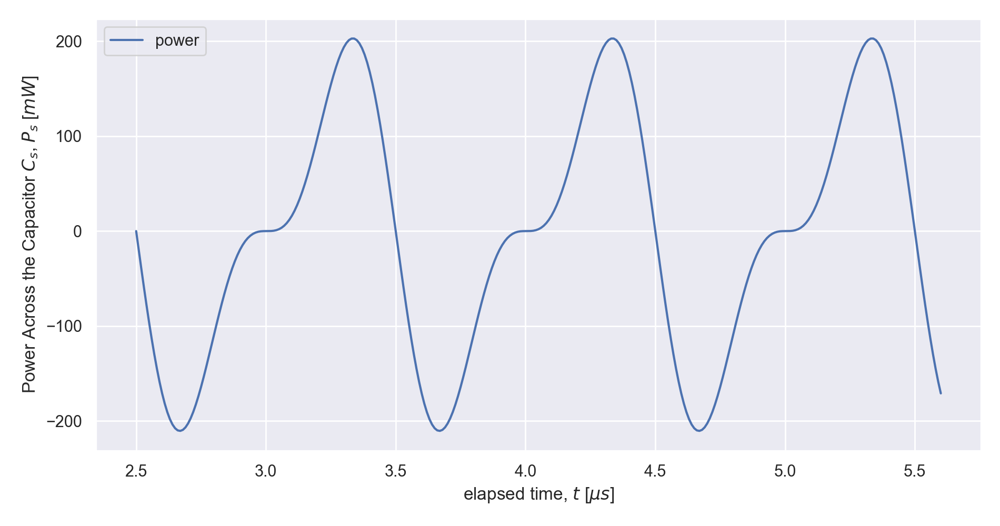

# Channel
### Class for time series/signal manipulation

The class Channel implements time series/signal as 2xN matrix whose first column can be considered the time vector or simply a vector used to associate the values to the second matrix columns of amplitudes.
Metadata such as sampling units, names, description, mathematical symbols, and user data can be associated to the channel object

Vectorization algebra and function methods calls are implement with the straightforward syntax, e.g.:

```python
from channel import Channel , generator as gen
from jumble.units_prefixed import us, MHz, uF
import numpy as np
import figs

dt  = 0.01*us
t0  = 2.0*us
t   = gen.steps(t0, 5*us, dt) # time vector
C_s = 1*uF
f0  = 1*MHz

I = Channel((t0, dt), np.sin(2*np.pi*f0*t),
            names           = ['time' , 'Current'],
            unitss          = ['s','A'],
            descriptions    = ["elapsed time", "Voltage across capacitor $C_s$"],
            symbols         = ["t", "I"])

V = 1/C_s*I.integrate_simpson()

P=V*I
```

Channel visualzation is implement as member of the class allowing simple and readable syntax:

```python
P.units       = "W"
P.symbol      = "P_s"
P.names       = [ "time","power"]
P.description = "Power Across the Capacitor $C_s$"

P[2.5*us:5.6*us].plot()

```



# Examples
* [Laser Pulse Analysis notebook](examples/laser_pulse.ipynb)

* [Pulse compression Naive Simulation notebook](examples/pulse_compression.ipynb)


### TODO
* refactor API for channel type defintion
* keep debugging
